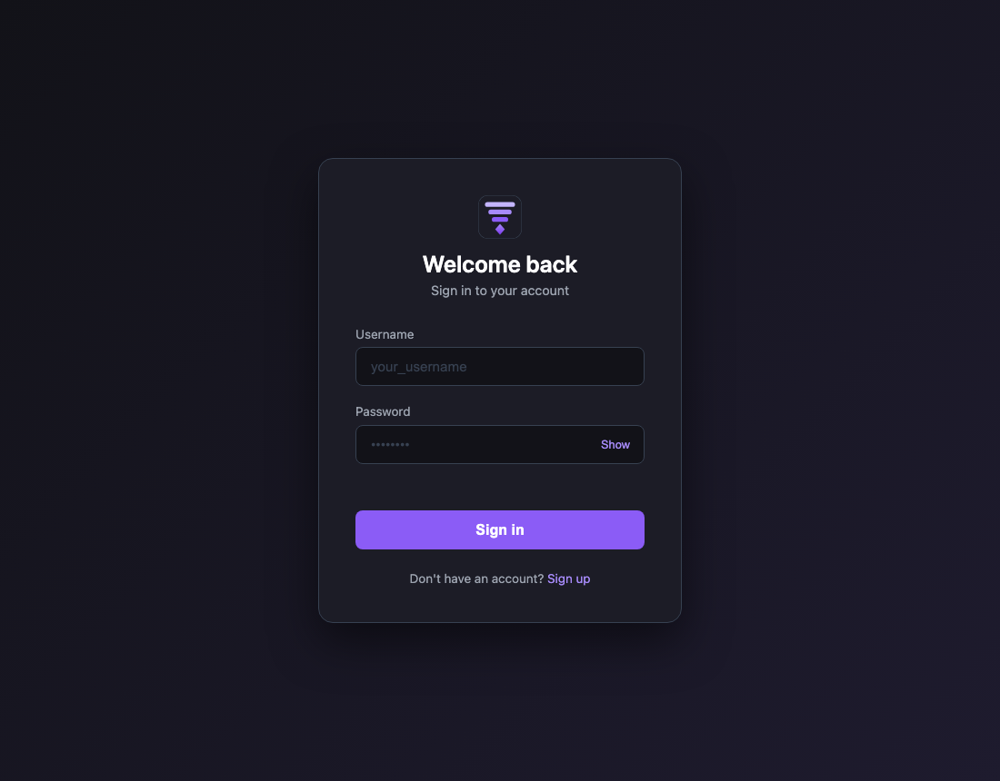

# DeepCellar

A local-first AI chat app that talks to your own
[Ollama](https://ollama.com) instance — local and cloud models, thinking
support, and real authentication, all wrapped in a dark purple UI.
DeepCellar is the foundation for an upcoming RAG chatbot: the chat, model
management, and auth layers are already in place.



## Features

**Chat**

- Streams replies from Ollama's native `/api/chat` endpoint through a
  FastAPI proxy (NDJSON)
- Conversational memory within a temporary session — the full message
  history is resent each turn (Ollama's chat API is stateless by design)
- Thinking models (detected natively via `capabilities`) get `think: true`
  automatically, with their reasoning shown in a collapsible block
- Assistant replies rendered as markdown (bold, lists, code blocks, tables)
  via vendored `marked` + `DOMPurify` — works fully offline
- Unified composer: message box, custom model dropdown, and send button in
  one smooth container

**Models**

- Model picker groups Cloud vs Local models and only lists chat-capable
  ones (native `"completion"` capability — embedding-only models are
  excluded)
- Models dashboard with per-model details: parameters, quantization,
  family, context length, size, host
- Thinking models are highlighted; non-chatable models get a distinct
  "not chatable" badge
- Detects when Ollama isn't running and tells you how to start it

**Accounts & security**

- Real local accounts: username + password signup/login, argon2 password
  hashing, SQLite storage
- JWT sessions in an HttpOnly, SameSite=Lax cookie
- Per-install secret key generated on first run — nothing sensitive is
  ever committed to the repo
- Only `static/` is served publicly; source code, the database, and the
  secret key are never exposed over HTTP

## Requirements

- Python 3.11+
- [Ollama](https://ollama.com) installed and running (`ollama serve`,
  or the desktop app)

## Quick start

```bash
git clone https://github.com/alouiadel/DeepCellar.git
cd DeepCellar

python3 -m venv .venv
.venv/bin/pip install -r requirements.txt

# make sure Ollama is running, then:
.venv/bin/python run_app.py
```

Open http://127.0.0.1:8000, create an account, and start chatting.

## Configuration

| Variable      | Default                  | Description           |
| ------------- | ------------------------ | --------------------- |
| `OLLAMA_HOST` | `http://localhost:11434` | Ollama server address |

## Project structure

```
DeepCellar/
├── run_app.py          Entry point (uvicorn launcher)
├── app/
│   ├── main.py         FastAPI app: auth API, model list, streaming chat proxy
│   ├── auth.py         argon2 hashing, JWT sessions, per-install secret key
│   ├── db.py           SQLite users table
│   └── ollama_client.py Ollama API client (model listing, chat streaming)
├── pages/
│   ├── index.html      Login / signup page
│   ├── app.html        Chat window (protected)
│   └── models.html     Models dashboard (protected)
├── requirements.txt
├── next.md             Roadmap: sessions, then RAG, then MCP/agents
├── static/
│   ├── style.css       Theme (purple / dark / gray)
│   ├── script.js       Login + signup logic
│   ├── app.js          Chat logic (streaming, memory, markdown)
│   ├── models.js       Dashboard logic
│   ├── vendor/         Pinned marked + DOMPurify (offline-friendly)
│   └── favicon.*       DeepCellar brand icon
└── docs/               Screenshots
```

Files created at runtime (gitignored): `deepcellar.db`, `.secret_key`.

## How it works

- **Auth** — passwords are hashed with argon2 (`pwdlib`) and stored in a
  local SQLite database. Logging in issues a signed JWT stored in an
  HttpOnly cookie; protected pages and API routes verify it.
- **Model detection** — everything comes from Ollama's `/api/tags`: cloud
  models carry a `remote_host`, thinking and chat capability come from the
  native `capabilities` array (with a `/api/show` fallback for older
  Ollama versions).
- **Chat memory** — Ollama's `/api/chat` is stateless, so the browser
  keeps the conversation and resends it with every message. Reloading or
  switching models starts a fresh temporary session.

## Roadmap

- RAG: document ingestion, embeddings, retrieval-augmented chats
- Persistent and multiple chat sessions
- Per-user preferences

## Development

Formatting (installed via Homebrew):

```bash
ruff check --fix . && ruff format .   # Python
prettier --write .                    # HTML / CSS / JS
```

## License

MIT — see [LICENSE](LICENSE).
